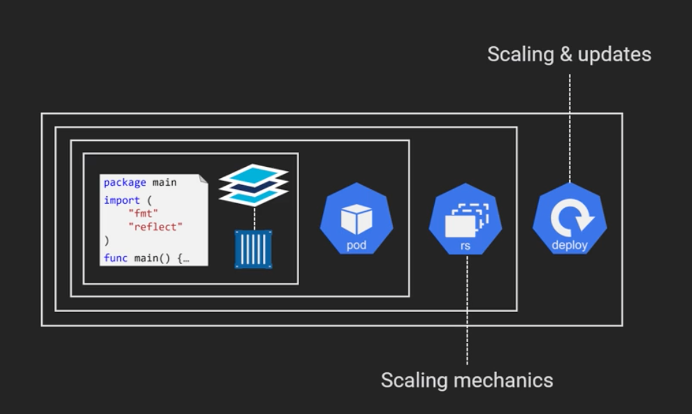
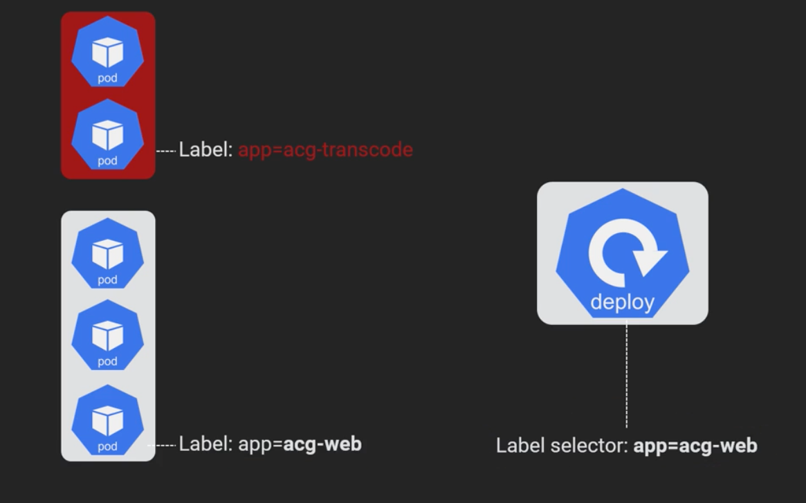

# Deployments
[](../images/k8s-deployment-theory.png)

## History

Provides a change cause if the `--record=true` flag was added to the `apply`.  E.g. `kubectl apply --filename=deploy.yml --record=true`
```
kubectl rollout history deploy <deployment>
```

Provides more details for a particular revision
```
kubectl rollout history deploy <deployment> --revision=<num>
```

## Rollback `rollout undo`

Rolls back to the previous version
``` 
kubectl rollout undo deploy <deployment>
```

## Labels
[](../images/k8s-deployment-label.png)
