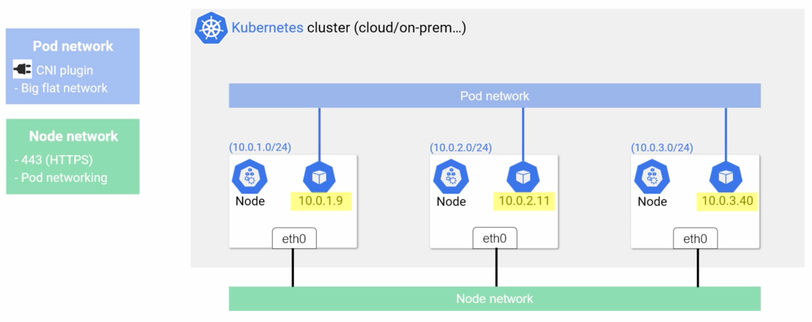
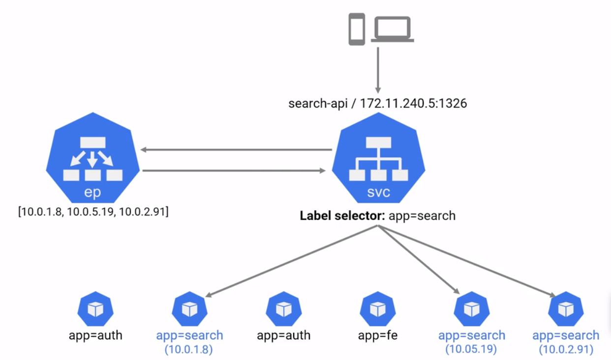
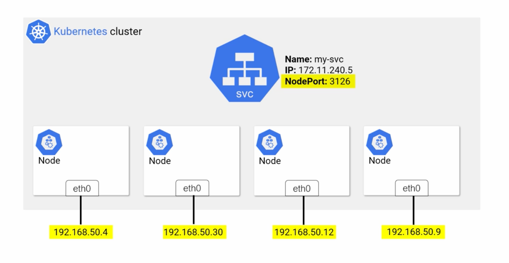
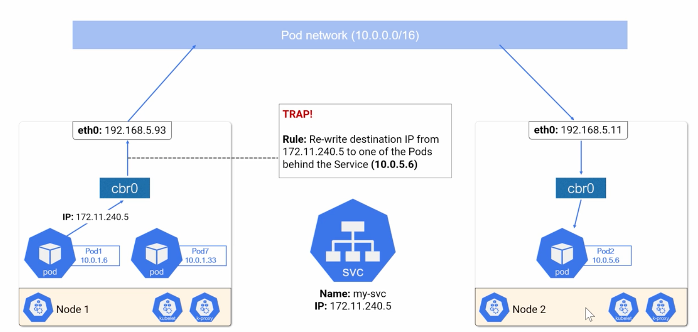

# Networking Basics

* All Nodes can talk to each other
* All Pods can talk to each other without NAT (big flat network)
* Every Pod gets its own IP address

* Service may provide
    * LoadBalancer
        * Integrates with public cloud platform
    * NodePort
        * gets cluster-wide PORT
        * also accessible from OUTSIDE the cluster
    * ClusterIP (default)
        * Gets own IP
        * Only accessible from within cluster

## NodePort

## Three Networks: Pod, Node, and Service

* Request for Service network routed through cbr0 and upstream to eth0.
* IPTABLES or IPVS rules apply and rewrite IP destination to a pod address
* IPVS is the new default since K8s 1.11
    * Native layer-4 load balancer
    * uses linux kernel IP virtual server

