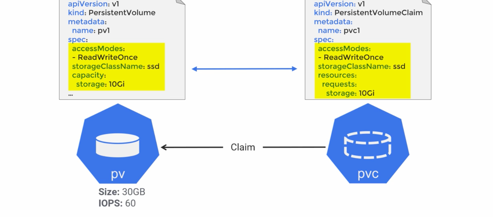

# Persistant Volumes

## Workflow
1. Create a storage resource on GCP, AWS, wherever 
1. Register it with k8s using a PV (makes external storage available on k8s cluster)
1. In order to use the PV, a PVC must be created
1. The pod spec references the PVC and mounts the volume (`volumeMounts`)

``` 
kubectl get pv
```

## Access Modes
* RWO - ReadWriteOnce : by ONE pod in the cluster
* RWM - ReadWriteMany : multiple pods in the cluster
* ROM - ReadOnlyMany : multiple pods can read in the cluster


## Reclaim Policy
* Retain - release a claim but the volume will stick around
* Delete - release a claim and k8s deletes it


# Persistant Volume Claim
[](../images/k8s-pv-and-pvc.png)
